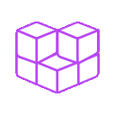

<!-- 
CREDITS/SOURCES

* https://animatedicons.co/icons/minimalistic?type=free
* https://www.terminalgif.com/

 -->

##  About Me

Hi there! I'm a seasoned technologist specialising in **Artificial Intelligence**, **Cyber Security**, and **Enterpirse Web Applications**. My work focuses on AI-powered user experiences, application integrations, and hardening infrastructure to keep systems secure.

Currently, I'm diving deep into LLM Resource Augmentation projects. With a diverse tech stack spanning AI tools like ChatGPT, Gemma, and PyTorch, cloud platforms from AWS to Azure, and programming languages including Python, Rust, and PHP, I thrive when I'm architecting applications that **re-define user experiences**.

##  Current Tech

    

        <strong>Artificial Intelligence</strong>
    

    

        
        
        
        
        
        
        
    

    

        <strong>Cloud</strong>
    

    

        
        
        
        
        
    

    

        <strong>Databases</strong>
    

    

        
        
        
        
        
        
        
    

    

        <strong>Languages</strong>
    

    

        
        
        
        
        
        
        
        
    

    

        <strong>Mobile Frameworks</strong>
    

    

        
        
    

    

        <strong>Operating Systems</strong>
    

    

        
        
        
        
        
        
    

    

        <strong>Servers</strong>
    

    

        
        
    

    

        <strong>Tooling</strong>
    

    

        
        
        
        
        
        
        
    

##  Favourite Projects
 
 
 
 

