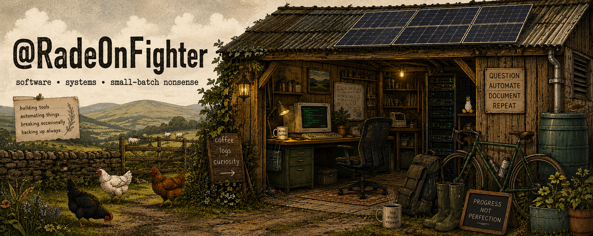
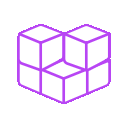

<!-- 
CREDITS/SOURCES

* https://animatedicons.co/icons/minimalistic?type=free
* https://www.terminalgif.com/

 -->

## Current projects:

- Convincing Docker containers to behave.

- Teaching local LLMs new tricks.

- Maintaining a small fleet of home servers that are more like pets to me at this point.

## Workbench

- 🌱 Terraform

- 🐳 Docker

- 🤖 Local AI

- 🍎 macOS utilities

- 📦 Home infrastructure

- 💾 Backups of backups

## Belief System

- If it isn't automated, it's a future problem.

- Move moving parts = more fututure problems

- The answer is usually a shell script.

## Recent obsessions

- AI agents

- Home servers

- Everything apple

## Tool Shed

    

        <strong>Artificial Intelligence</strong>
    

    

        
        
        
        
        
        
        
    

    

        <strong>Cloud</strong>
    

    

        
        
        
        
        
    

    

        <strong>Databases</strong>
    

    

        
        
        
        
        
        
    

    

        <strong>Languages</strong>
    

    

        
        
        
        
        
        
        
        
    

    

        <strong>Mobile Frameworks</strong>
    

    

        
        
    

    

        <strong>Operating Systems</strong>
    

    

        
        
        
        
        
        
    

    

        <strong>Servers</strong>
    

    

        
        
    

    

        <strong>Tooling</strong>
    

    

        
        
        
        
        
        
        
    

##  Favourite Projects

